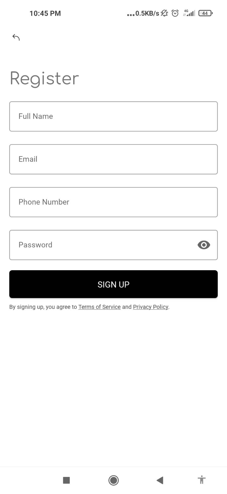
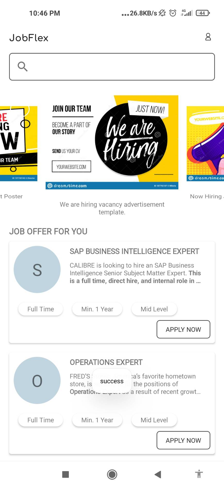
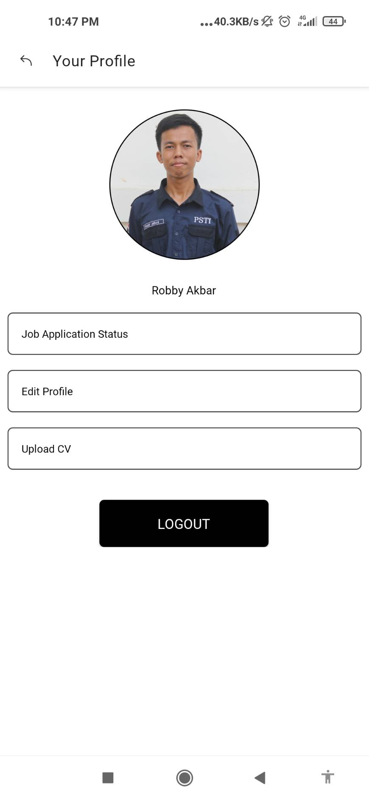
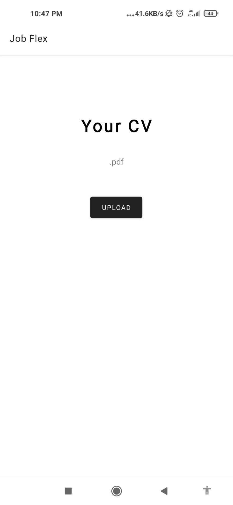
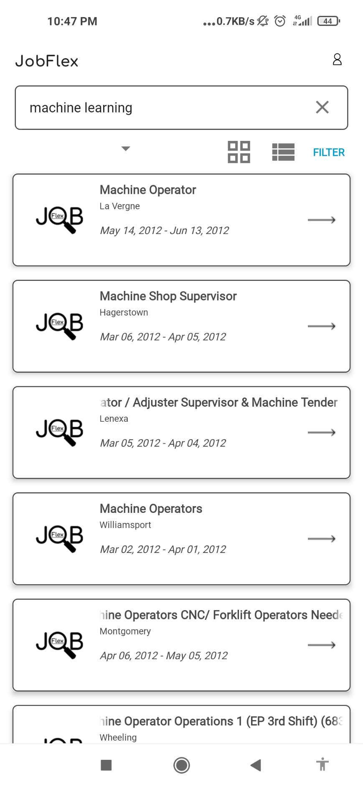
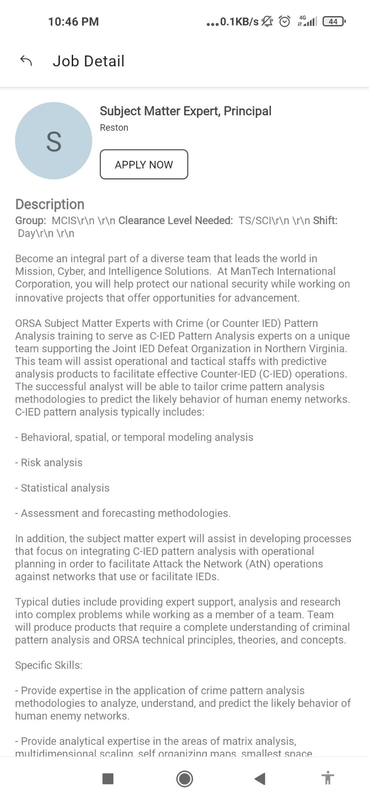

<!-- PROJECT LOGO -->
<br />
<p align="center">
  <a href="https://github.com/RobbyAkbar/JobFlex">
    
  </a>

  <h2 align="center">One-Stop Mobile Job Searching Platform</h2>

  <p align="center">
    Google Bangkit Capstone Project 2021 - CAP0139 - Exwara
    <br />
    <a href="https://docs.google.com/presentation/d/1G63phpBTalT-cIOkGxMyQqwxJe1kSm_IUX140RSOWJM/edit?usp=sharing"><strong>Explore the docs »</strong></a>
    <br />
    <br />
    <a href="https://drive.google.com/file/d/1Vt6KB5zseLPs6UoG0SalCYto4tjHQMn7/view?usp=sharing">View Demo</a>
    ·
    <a href="https://drive.google.com/file/d/1LtdbJARqVMaB1o57OzoVXpfb71ANXdD_/view?usp=sharing">Download APK</a>
    ·
    <a href="https://github.com/RobbyAkbar/JobFlex/issues">Report Issues</a>
  </p>
</p>

<!-- TABLE OF CONTENTS -->
<details open="open">
  <summary>Table of Contents</summary>
  <ol>
    <li><a href="#background">Background</a></li>
    <li><a href="#core-values">Core Values</a></li>
    <li><a href="#application-preview">Application Preview</a></li>
    <li><a href="#deployment-steps">Deployment Steps</a></li>
  </ol>
</details>

## Background
In August 2020, Badan Pusat Statistik (BPS) stated that the level of unemployment in Jakarta is 10.95%, the highest out of all provinces in Indonesia. How can technology help reduce the labor immobility causing high frictional unemployment level in Jakarta, which occurs when a person is searching for or transitioning to a new job but can’t find the related information? Overabundance of job searching platforms makes job seeking difficult for on-the-go job seekers. A good company and employee fit will increase productivity in the capital city, therefore contributing a significant amount in stabilizing or improving Indonesia’s economy.

## Core Values
1.  **One for All** - We unite job information from various sources into one-single platform (for this MVP we still use internal database).
2.  **Recommendation System Based on Profile** - Fresh graduates or new workers who enters workforces will be able to get job recommendations based on their profiles/resumes.
3.  **Recommendation System Based on Job Features** - Workers who are looking for new jobs will be able to get job recommendations based on similar jobs they are interested in or have applied in the past (still ongoing).
4.  **Recommendation System Based on Similar Users** - We will also cluster people who have similar interests and backgrounds, thus giving recommendations back to people from the same group (still ongoing).

## Application Preview
These are a few screenshots of the working application. To see the demo video, click on this [link](https://drive.google.com/file/d/1Vt6KB5zseLPs6UoG0SalCYto4tjHQMn7/view?usp=sharing).

|  |  |  |  | 
|:--:|:--:|:--:|:--:|
| *Login Page* | *Registration Page* | *Main Dashboard* | *Profile Page* |

|  |  |  |
|:--:|:--:|:--:|
| *Upload CV* | *Search Results* | *Job Details* |

## Deployment Steps
Assuming you have configured your GCP Project, here are the steps of deploying this integration of ML to the cloud.
1.  Create a storage bucket for storing user's resumes (in .pdf format). In this example we will be using **job-flex-storage** as the bucket.
2.  Create a dataset in Big Query under your project. In this example we will be using **jobsData** as the dataset.
3.  Import your job database to the dataset. In this example we will be using jobs.tsv that can be downloaded from this [link](https://www.kaggle.com/c/job-recommendation/data)
4.  Setup Firebase to your GCP Project, and follow the steps provided to setup Firebase Authentication.
5.  Create a compute engine instance. The type should be at least n1-standard-1.
6.  SSH into the VM instance you've just created. In the SSH terminal, clone this repository.
    ```sh
    git clone https://github.com/RobbyAkbar/JobFlex.git
    ```
    Make sure to install pip by running these scripts.
    ```sh
    sudo apt-get update
    sudo apt-get install python3-pip -y
    ```
    After pip installed, run these scripts to install all the dependency needed.
    ```sh
    pip3 install google-cloud-bigquery
    pip3 install google-cloud-storage
    pip3 install Flask
    pip3 install tensorflow
    pip3 install keras
    pip3 install pandas
    pip3 install scikit-learn
    ```
    Move the working directory to `cloud_integration` and edit the `integration.py` file.
    ```sh
    cd cloud_integration
    nano integration.py
    ```
    Inside the file, edit line 37 to match your bucket name, and edit `FROM` toQuery in line 46 and query_job in line 62 to match your dataset
    ```python3
    ...
    bucketName="<YOUR_BUCKET_NAME>"
    .
    .
    .
    toQuery = "SELECT * from `<YOUR_PROJECT>.<YOUR_DATASET>.<YOUR TABLE>` where lower(Title) LIKE '%"+jobNameList[0].lower()+"%'"
    .
    .
    .
    query_job = client.query(
        '''
        SELECT
            JSON_EXTRACT_SCALAR(h,'$.JobID') as JobID,
            JSON_EXTRACT_SCALAR(h,'$.WindowID') as WindowID,
            JSON_EXTRACT_SCALAR(h,'$.Title') as Title,
            JSON_EXTRACT_SCALAR(h,'$.Description') as Description,
            JSON_EXTRACT_SCALAR(h,'$.Requirements') as Requirements,
            JSON_EXTRACT_SCALAR(h,'$.City') as City,
            JSON_EXTRACT_SCALAR(h,'$.State') as State,
            JSON_EXTRACT_SCALAR(h,'$.Country') as Country,
            JSON_EXTRACT_SCALAR(h,'$.Zip5') as Zip5,
            JSON_EXTRACT_SCALAR(h,'$.StartDate') as StartDate,
            JSON_EXTRACT_SCALAR(h,'$.EndDate') as EndDate
        FROM `<YOUR_PROJECT>.<YOUR_DATASET>.<YOUR TABLE>`
        LEFT join unnest(json_extract_array(recommendation)) as h
        '''+'WHERE id LIKE "'+id+'"'
    )
    ```
    Save and exit from the file by entering `CTRL+X, Y, ENTER`. Make sure you grant permission for executing the file.
    ```sh
    sudo chmod +x integration.py
    ```
    You're ready to run! To run the program in background while maintaining the output, we will use `nohup`. The output should be redirected to your desired file (in this example we will use **integrationOut.log**).
    ```sh
    nohup ./integration.py > integrationOut.log &
    ```
4.  Make sure you create firewall rule for the default network at TCP Port 8080, with access granted to all incoming IP `0.0.0.0/0`. You could use other port by simply editing the last line of integration.py `app.run(host = "0.0.0.0",port=<DESIRED_PORT>)`
5.  To test out the functionality of the app, simply download and install [JobFlex.apk](https://drive.google.com/file/d/1LtdbJARqVMaB1o57OzoVXpfb71ANXdD_/view?usp=sharing) in your Android Device.

Happy Testing!


